# DDSP-VST
 

TBD

## Project Objectives
### What?
TBD

### Why / Inspirations:
TBD

## About this document

This document has ...

## Training & Using Customized Model
### Environment Setup

- Upload the training_notbook.ipynb under notebook to https://colab.research.google.com/.
    [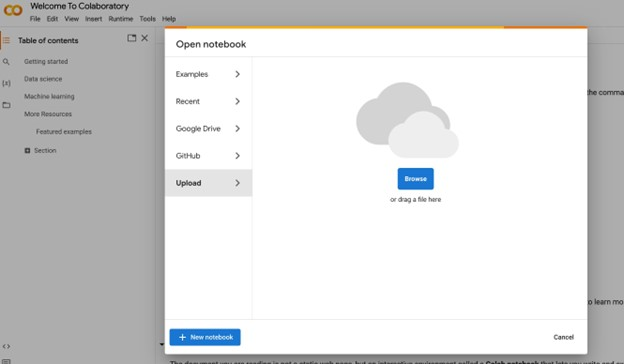](https://colab.research.google.com/)

- After uploading the file, you will find cells containing code. Click on the ▶ button in the upper left corner to execute the first cell and set up the environment. Please wait until it's completed (a ☑ will appear in the upper left corner).

    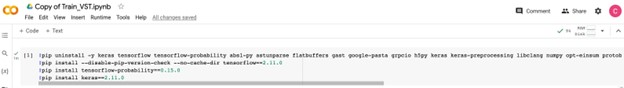

- You need to restart the runtime to continue.

    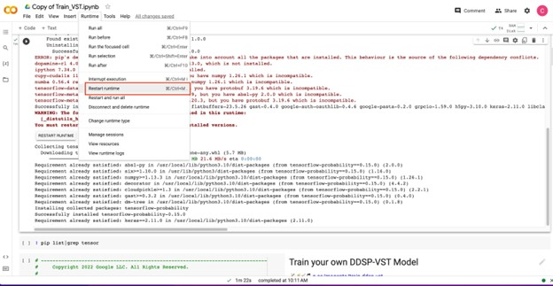

- After restarting, execute cell 2 directly as shown in the screenshot below __(DO NOT rerun the first cell)__, and verify if the output matches the result displayed below:

     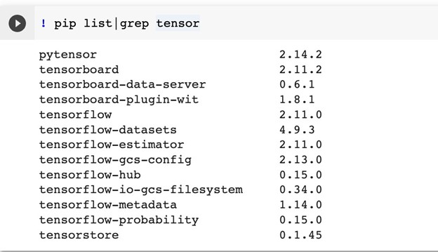

### Prepare Data
If everything is functioning as expected, we can proceed to the final cell for training. However, before starting the training process, it's essential to upload your training audio files to Google Drive. Custom models can be trained effectively with as little as 10 minutes of audio data in either .wav or .mp3 format. For the best results, consider using "monophonic" audio, meaning there's only one note being played at a time. It's ideal to use audio from a single recording session with the same microphone and reverb settings for optimal training outcomes.

You need create a folder on your drive with your audio files in it, for example, I create a folder DDSP_training/CelloSuiteBach and put all mp3 files inside the folder:

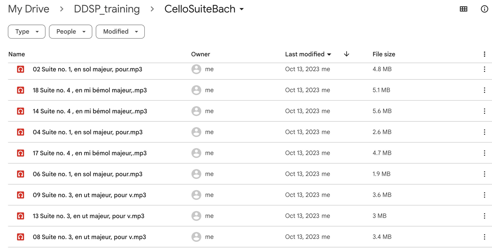

### Start Training

Before we start training, we need set a name for our model in the 3rd cell:

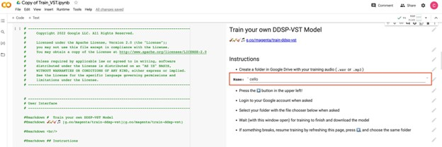

Then press the ▶ button in the upper left of 3rd cell to start training, you will see some output of this cell and a popup ask for google drive permission, choose __Connect to google Drive__ to continue.

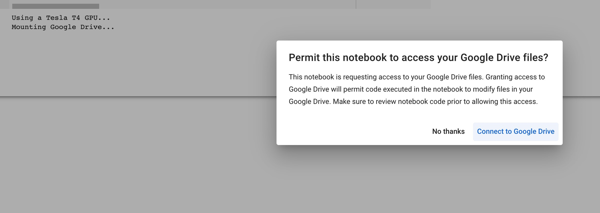

The output of the cell will let you pick your folder that contains your training data. Select the folder and training will automatically start.

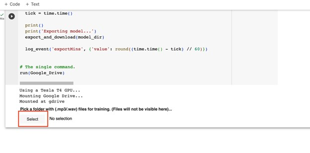

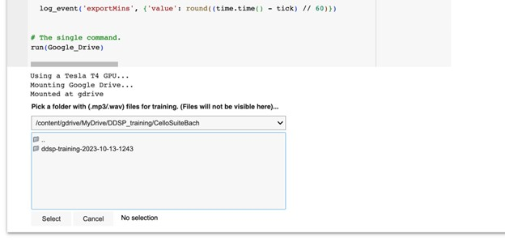

You will observe output similar to the following during the training process. Please be aware that training can be time-consuming when using the free Colab service. If you happen to experience a disconnection, simply reconnect and follow the steps mentioned earlier, ensuring that you select the same folder. The training will continue from where it was paused or left off.

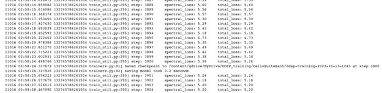

### Use the New Model
After the training is completed, the Colab should automatically export, compress (zip), and download your model folder. If the download doesn't start automatically, you can locate the model in your training folder with a name like __ddsp-training-{date-time}/{Name}__.

To use your model, you should unzip the folder and place the entire contents in the plugin model folder. On macOS, the plugin model folder path is typically __Documents/Magenta/DDSP/Models__. You can also access this folder within the plugin's panel.

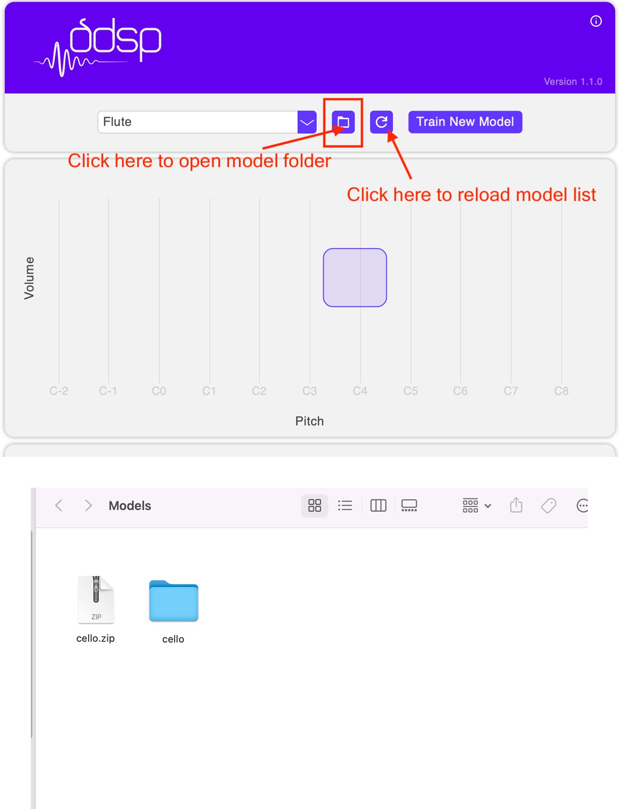
