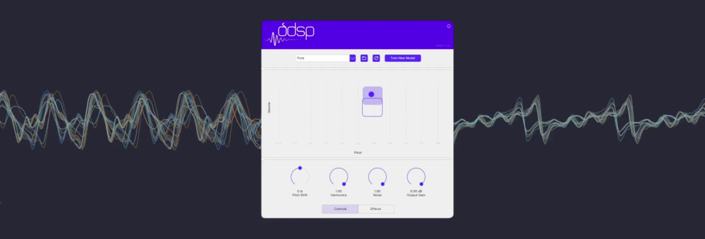

# Differentiable Digital Signal Processing (DDSP)-VST
 

## 1. Project context
In a technology-powered futuristic orchestra, it is crucial for musical machines to convey the __`nuances and emotions`__ inherent in human performances, instead of yielding uniform sounds that lack a personal touch. The foundation for such a capability lies in a synthesizer's ability to capture and reproduce the subtleties and nuances of real instrumental sounds. Learning from a diverse set of performance data that includes these nuances, __`neural synthesizers`__ can potentially capture and retain the subtle nuances of pitch and dynamics in sound generation. Furthermore, there are more potential benefits:
- __Flexibility__: They can generate a wide range of sounds and timbres that might not be available in sample libraries (__`sample-based synthesizer`__) or that are difficult to model using physical equations (__`physics-based synthesizer`__).
- __Adaptability__: Neural networks can be trained to adapt to different styles and dynamics of playing, potentially offering more personalized expression based on the training data.
- __Interactivity__: These synthesizers can be designed to respond to various inputs in real-time, allowing for interactive performances that can mimic the responsiveness of a human musician.
- __Innovation__: Neural synthesizers can continue to learn and improve over time with additional training data, which can lead to new and unique sounds.

One such neural synthesizer is [DDSP](https://magenta.tensorflow.org/ddsp), a library of differentiable versions of common DSP functions (such as synthesizers, waveshapers, and filters). This allows these interpretable elements to be used as part of an deep learning model for audio generation. 

## 2. Project objective
AI is a new domain to me. To explore and understand the innovative AI-powered sound synthesizer, I dived into the [open-source DDSP-VST tool](https://magenta.tensorflow.org/ddsp-vst) developed by Google's DDSP research team. Among its multitude of features, I began by delving into one of its distinctive capabilities: morphing input sound into a variety of instruments while preserving the nuances of pitch and dynamics. 

## 3. Training phase: train a neural synthesizer

The original [Google Colab notebook](https://colab.research.google.com/github/magenta/ddsp/blob/main/ddsp/colab/demos/Train_VST.ipynb) for training the neural synthesizer, as provided by Google researchers, is now __non-functional__. This incompatibility issue arises because the source code has not been updated to align with the latest versions of the TensorFlow environment and the Python language.

With help from my brother, who is conducting AI research in graduate school, I was able to modify the Colab source code to restore its functionality. Although warnings and errors appear during execution, they __do not impede__ the training process.

My version of the Colab training notebook can be found at: "__`notebooks/Training_notebook_VST_v2_with_comment`__". Below is a detailed guide outlining the steps involved in the training process.

### 3.1 Environment Setup

- Upload the Colab notebook to https://colab.research.google.com/.

    [](https://colab.research.google.com/)

- After launching the notebook, click on the ▶ button in the upper left corner to execute the first cell and set up the training environment. Please wait until it's completed (a ☑ will appear in the upper left corner).

    

- Then you need to restart the runtime to continue.

    

- After restarting the runtime successfully, execute cell 2 as shown in the screenshot below __(<span style="color: red;">DO NOT run the first cell again!</span>)__, and verify if the output matches the result displayed below:

     

### 3.2 Data preparation
Now you can proceed to the final cell for initiating training. Prior to beginning the training sequence, you need to upload your training audio files to Google Drive. Effective custom model training can be achieved with a minimum of 10 minutes of audio data, which can be in .wav or .mp3 formats. For optimal results, it is recommended to utilize 'monophonic' audio, which contains only a single note played at any given moment. To ensure consistency and the highest quality of training, it is also recommended to use audio from a single recording session, maintaining uniform microphone and reverb settings throughout.

You should create a folder on your Google Drive to store your audio files. For instance, I created a folder named 'DDSP_training/CelloSuiteBach' and placed all the mp3 files within this folder.


### 3.2 Start Training

One additional step before we initiate training is to assign a name to our model. This is done in the third cell of the notebook:


Then press the ▶ button located at the top left corner of the third cell to commence training. You will observe some output from this cell, followed by a popup requesting permission to access Google Drive. Choose __<span style="color: red;">Connect to Google Drive</span>__ to continue.


The cell's output will prompt you to select your folder containing the training data. Once you choose the appropriate folder, the training will begin right away.


During the training process, you will see output resembling the following. It's important to note that training may be a lengthy process, especially on the free version of Colab. In the event of a disconnection, just reconnect and repeat the previously outlined steps, making sure to choose the same training data folder. The training will resume from the point it was interrupted.


### Import the trained model to Garageband as a new VST plugin
Upon completion of the training, the Colab notebook will automatically export and compress (zip) the model, followed by downloading it directly to your designated model folder. If the download doesn't start automatically, you can locate the model in your training folder with a name like __<span style="color: red;">ddsp-training-{date-time}/{Name}</span>__.

To use your model, you should unzip the folder and place the entire contents in the plugin model folder. On macOS, the plugin model folder path is typically __<span style="color: red;">Documents/Magenta/DDSP/Models</span>__. You can also access this folder from the plugin's panel.


## 4. Inference phase: morph a range of input sounds into various instrumental outputs

There are multiple use cases for the trained model.

### 4.1 Transform the familiar into the unexpected
First, I experimented with the transformative capabilities of DDSP, using the AI singer Merrow's singing recordings as input for the DDSP flute and trumpet synthesizers. This experiment yielded a broad array of timbres that markedly deviated from the original vocal quality.
```diff
- Unmute the speaker in the video clip to listen to the ~5 second recording.
```
- __Merrow Solo:__
  
https://github.com/JeffreyLuo333/DDSP-VST/assets/114297879/cd875813-750a-409d-a1e8-5776a280acbc

- __Transform Merrow to Flute:__

https://github.com/JeffreyLuo333/DDSP-VST/assets/114297879/b2b01e89-8424-491a-82c2-c72fe38b1048

- __Transform Merrow to Trumpet:__

https://github.com/JeffreyLuo333/DDSP-VST/assets/114297879/da4be448-40f4-454f-bfe2-357b4360197a

### 4.2 Play it like a Synth
Then, I employed the DDSP-VST in the same manner as a traditional VST for my research. In this inquiry, I utilized two instruments—a violin and a cello—both of which I trained personally to aid in comparative analysis. The performance of the DDSP-VST was then assessed alongside two other VST plugins: Studio, which is sample-based and the other, SWAM, which is physics-based.
```diff
- Unmute the speaker in the video clip to listen to the ~10 second recording.
```
#### Violin:  
- __DDSP Violin VST__
  
https://github.com/JeffreyLuo333/DDSP-VST/assets/114297879/f2eec8f9-be95-406f-bf7e-c12de8843e1d

- __Studio Violin VST__
  
https://github.com/JeffreyLuo333/DDSP-VST/assets/114297879/c46910e1-30b9-484c-aba3-90023acfe229

- __SWAM Violin VST__
  
https://github.com/JeffreyLuo333/DDSP-VST/assets/114297879/d45f85f4-fb9d-4a58-91e2-3053262c99c3

#### Cello: 
- __DDSP Cello VST__

https://github.com/JeffreyLuo333/DDSP-VST/assets/114297879/d707f775-8f7c-4f97-ae65-5fbf365c825d

- __Studio Cello VST__

https://github.com/JeffreyLuo333/DDSP-VST/assets/114297879/9bca26ee-48bb-43af-842c-1e497573cbf5

- __SWAM Cello VST__

https://github.com/JeffreyLuo333/DDSP-VST/assets/114297879/ef965a42-f3a9-4b54-8016-a28023b9c83a

### 4.3 Transform from piano into cello
- __Piano Soundtrack:__
  
https://github.com/JeffreyLuo333/DDSP-VST/assets/114297879/64154ed7-a755-49de-a558-7ce6779f60d6

- __Transformed from Piano to Cello:__

https://github.com/JeffreyLuo333/DDSP-VST/assets/114297879/67c921d8-03fd-4cc9-a956-17a7634546f3

## 5. Conclusions
In contrast to sample-based synthesizers, neural synthesizers don't require vast amounts of storage for high-quality samples and offer more variability since they're not limited to the recorded samples. Compared to physics-based synthesizers, which often demand significant computational power and expertise to accurately model physical systems, neural synthesizers can generate complex sounds without explicitly programming the physical behaviors of instruments. 

However, if the neural network hasn't been sufficiently trained on appropriate data, a neural synthesizer will be outperformed by the richness and authenticity of a physics-based model or a high-quality sample library. During my experimentation, I trained the model with very limited amount of data, which adversely affected the quality of the generated sounds. My plan is to find further the experimentation.

## 6. The relationship between DDSP and NSynth
In case you are curious about how they correlate to each other, here's a synthesis of what I've gathered from the literature.

DDSP and NSynth are both research projects developed by Google that leverage deep learning for audio and music generation. While they share some similarities in their use of neural networks for synthesizing sounds, they have different approaches and focus areas.

### NSynth
- Focus: NSynth is focused on generating novel sounds by combining the acoustic qualities of different instruments. It uses a deep neural network to learn the characteristics of sounds from various instruments and then interpolate between them to create new, hybrid sounds.
- Architecture: It employs an autoencoder architecture, where an encoder network transforms audio into a latent space, and a decoder network reconstructs audio from this latent space.
- Interpolation: One of the key features of NSynth is its ability to smoothly interpolate between different instrument sounds, creating a continuum of sounds that blend the characteristics of the original instruments.

### DDSP
- Focus: DDSP, on the other hand, focuses on generating high-quality musical sounds with precise control over their timbral characteristics. It incorporates traditional signal processing elements within a differentiable framework, allowing for the use of gradient descent and backpropagation for optimizing sound synthesis parameters.
- Integration with DSP: DDSP integrates deep learning with traditional digital signal processing (DSP) techniques. It uses neural networks to predict the parameters of DSP-based synthesizers and effects, enabling the generation of realistic and expressive musical sounds.
- Expressiveness: A major strength of DDSP is its ability to generate expressive instrumental sounds, capturing the nuances of different playing techniques.

### Summary
While NSynth focuses on sound interpolation and the generation of novel timbres, DDSP emphasizes realistic and expressive sound generation, integrating deep learning with traditional DSP techniques.

Even though NSynth and DDSP are distinct projects with different focuses and approaches, they are both part of the broader landscape of neural audio synthesis, contributing to the development of innovative tools for sound generation and manipulation using deep learning.
